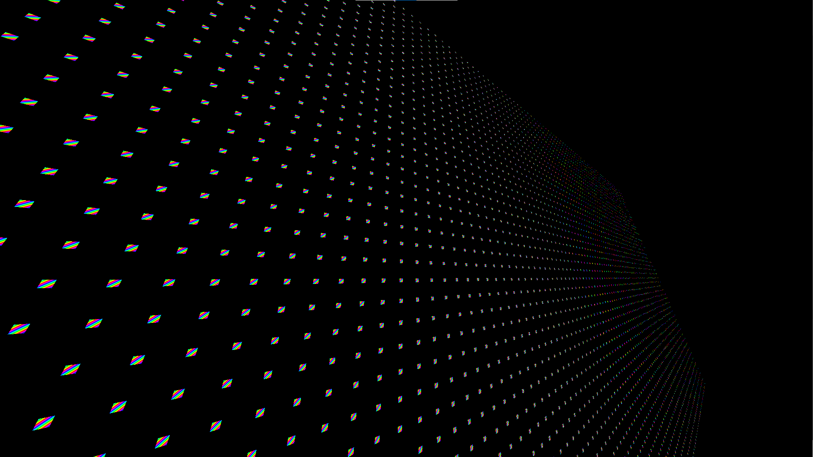

# Python OpenGL Basic Engine

## Introduction

This toy engine is built for practicing and learning OpenGL, providing a platform to experiment with rendering, shaders, and basic engine architecture.

## Installation
```bash
git clone https://github.com/kstzl/python-opengl-basic-engine
cd python-opengl-basic-engine
pip install -r requirements.txt
```
## Running the FPS Test Game

```bash
python ./runFPSGame.py
```
Controls : W A S D

## Running the Batch Rendering Test Game

```bash
python ./runBatchRenderingTests.py
```

Controls : W A S D